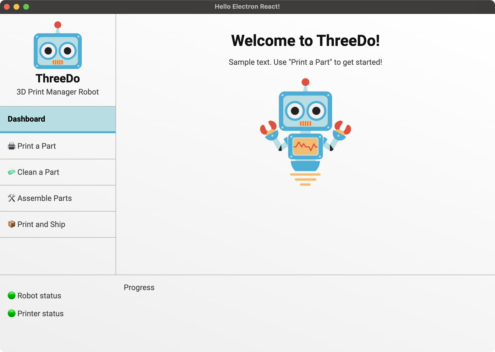
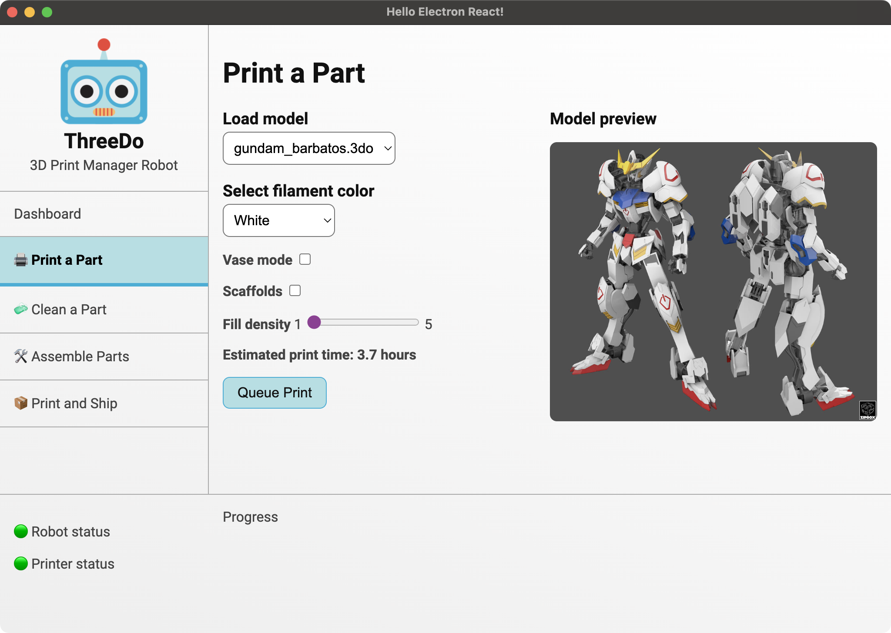

# morellam-dev / ucd-prototype

A UI mockup of "ThreeDo", a fictional robot control application, built in Electron and React.

For SWE 4324 User Centered Design.





See the full mockup design ["ThreeDo Protoype" on Figma](https://www.figma.com/file/EpF6hZI6Qlxai8PUgNLAW6/ThreeDo-Prototype?type=design&node-id=0%3A1&mode=design&t=rbPeN5b9UYy9Rvqm-1).

## Usage

### Install

Clone the repo and install dependencies:

```bash
git clone --depth 1 --branch main https://github.com/morellam-dev/ucd-prototype.git
cd ucd-prototype
npm install
```

### Starting Development

Start the app in the `dev` environment:

```bash
npm start
```


## License

MIT © [Electron React Boilerplate](https://github.com/electron-react-boilerplate)

MIT © Mae Morella

Repository based on <https://electron-react-boilerplate.js.org>
